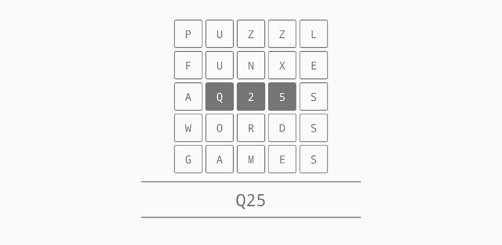
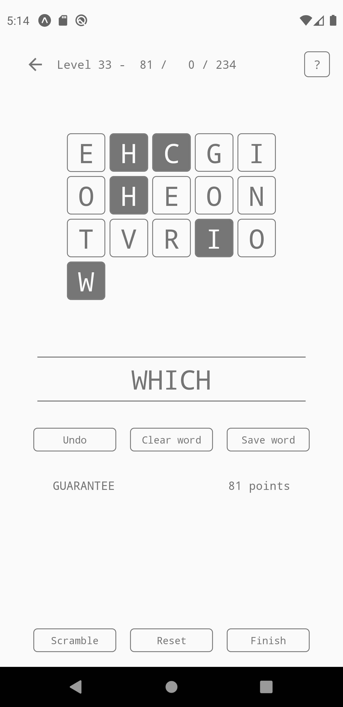
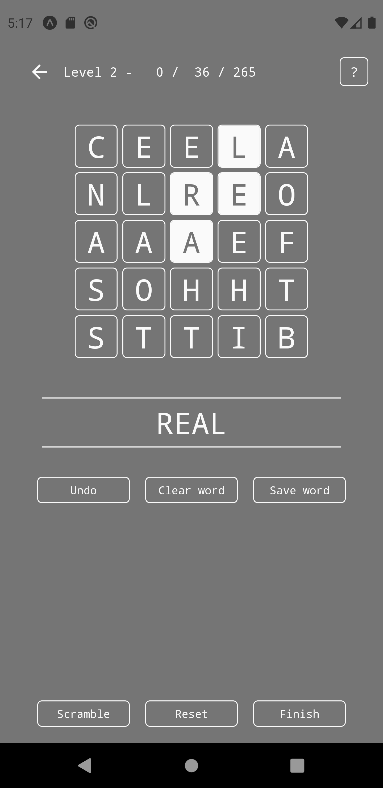
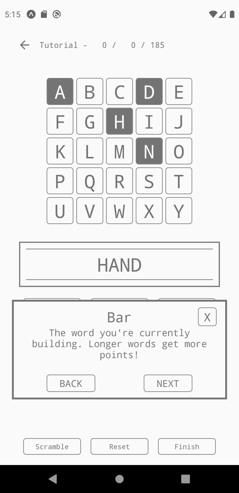
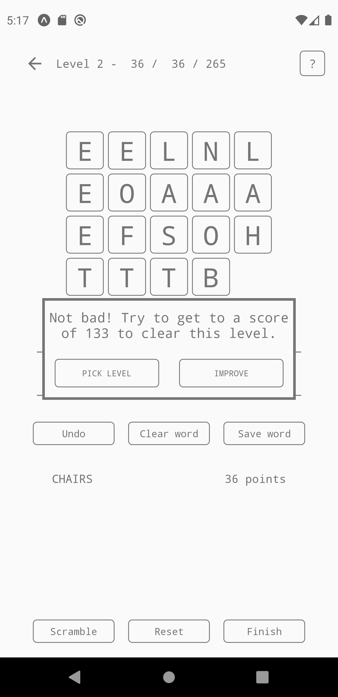
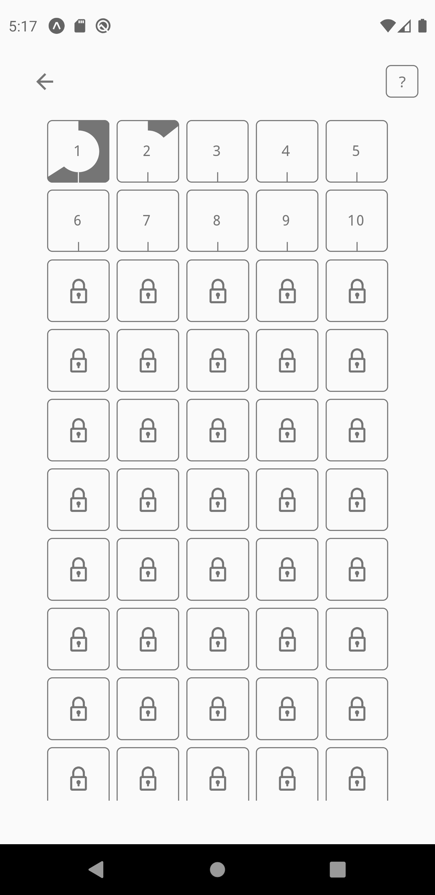
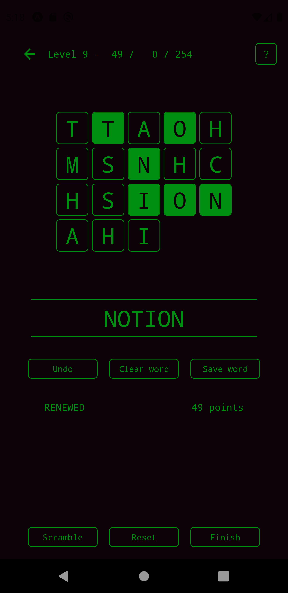

Q25 is a mobile word game written in React Native for Android. The game is available on the [Google Play Store](https://play.google.com/store/apps/details?id=com.fpringle.q25).

The aim of the game is to build words from a grid of 25 letters, without reusing tiles. Longer words earn you more points, and if you score well enough you'll unlock higher levels. For more details see the in-app tutorial.

# Gallery

# Accreditation

Q25 is made by [Frederick Pringle](https://github.com/fpringle) using [React Native](https://reactnative.dev/) and [Expo](https://expo.dev/).

Thanks to [Kevin Atkinson](http://www.kevina.org/) for creating the [SCOWL wordlist](http://wordlist.aspell.net/) and making it publicly available.

[Lock Icon Vector](https://www.freeiconspng.com/img/29056) courtesy of [Free Icons PNG](https://www.freeiconspng.com/).

Other open-source software used in this app:

 - [React Navigation](https://reactnavigation.org/)                                                                                     
 - [react-native-picker](https://github.com/react-native-picker/picker)                                                                 
 - [react-native-svg](https://github.com/react-native-svg/react-native-svg)                                                             
 - [Sentry](https://sentry.io/)                                                                                                         
 - [Redux](https://redux.js.org/)                                                                                                       
 - [React Native Elements](https://reactnativeelements.com/)                                                                            
 - [React Native Paper](https://callstack.github.io/react-native-paper/)                                                                
 - [Redux Persist](https://github.com/rt2zz/redux-persist)
